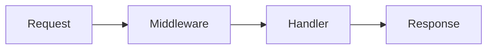
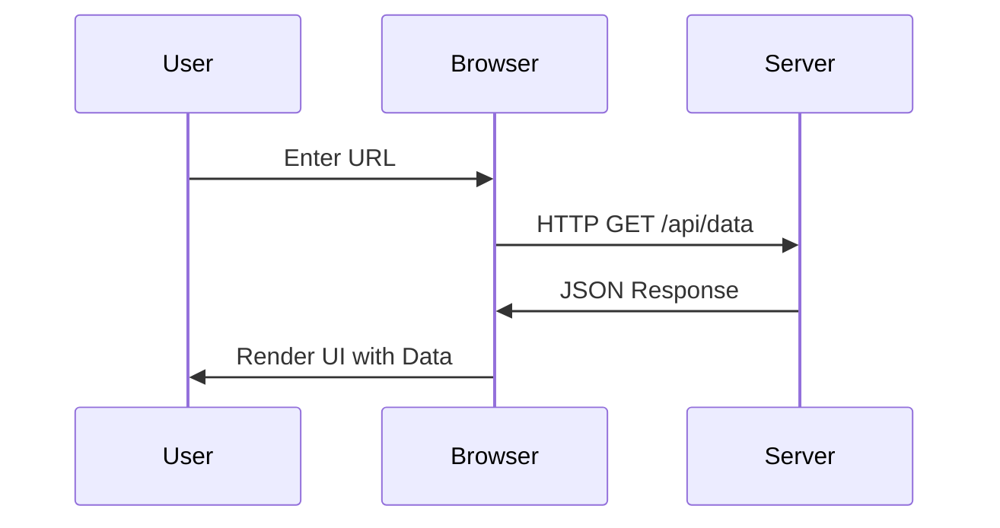

# Frontend Technical Blog Writer

Master the art of technical writing specifically for the frontend ecosystem. This skill helps you craft high-quality, engaging, and technically accurate blog posts that resonate with developers, build your personal brand, and contribute to the community.

## Overview

Technical writing for frontend is a unique blend of code clarity, visual explanation, and empathetic teaching. Whether you're writing a simple tutorial or a deep dive into React internals, the goal is to make complex concepts accessible while providing actionable value.

**Key Focus Areas:**
- **Tutorials**: Clear, step-by-step implementation guides.
- **Comparisons**: Objective analysis of frameworks and libraries.
- **Performance**: Data-driven optimization techniques.
- **Architecture**: Scalable patterns for modern web apps.
- **Deep-Dives**: Explaining the "how" and "why" behind the tools.
- **Migrations**: Practical experience from real-world upgrades.

---

## When to Use This Skill

- Writing a technical tutorial for a new library or feature.

- Planning a series of blog posts for a company engineering blog.

- Creating a framework comparison (e.g., React vs. SolidJS).

- Documenting a complex migration process for the community.

- Analyzing performance bottlenecks and sharing solutions.

- Building a personal brand through consistent technical content.

- Preparing documentation that reads like a story.

- Contributing to open-source project documentation.

- Explaining complex architectural decisions to your team.

- Creating internal "How-To" guides for onboarding new developers.

---

## Do Not Use This Skill When

- Writing marketing copy or purely non-technical content.

- Creating low-effort "listicles" without technical depth.

- Writing documentation that is purely auto-generated from code.

- Covering topics outside the frontend/web development domain.

- Writing for a non-technical audience (unless explicitly adapting).

---

## Core Principles of Frontend Writing

### 1. Show, Don't Just Tell

Frontend is inherently visual. A paragraph describing a UI interaction is rarely as effective as a GIF or a runnable demo. Always provide a visual anchor. Use tools like ScreenStudio or Lottie for high-quality animations. A well-placed screenshot can save 500 words of complex description.

### 2. Empathy-Driven Instruction

Remember your "beginner's mind." What was confusing when you first learned this? Address those gaps explicitly. Avoid words like "simply," "obviously," or "just," which can alienate readers who find the topic difficult. Instead, use "This step involves..." or "We can achieve this by..." to guide the reader gently through the complexity.

### 3. Progressive Disclosure

Start with the simplest mental model. Layer on complexity only after the foundation is solid. Don't dump 500 lines of code in the first section. Start with a 5-line example that performs the core task, then add error handling, performance optimizations, and edge cases in subsequent sections.

### 4. Technical Rigor

Your credibility depends on accuracy. Verify every snippet. Mention versions. Explicitly state assumptions and constraints. If you are using an experimental feature or a "canary" release, warn the reader clearly so they don't break their production environment.

---

## Content Strategy & Ideation

### 1. Identifying Your Audience

Before writing a single word, define who you are writing for:

- **Beginners**: Focus on fundamental concepts, clear definitions, and no assumptions about prior knowledge. Explain what "state" means before using `useState`. Use analogies from everyday life like comparing variables to storage boxes. Focus on "The What."

- **Intermediate**: Focus on "best practices," real-world problems, and architectural patterns. Discuss things like "Atomic Design," "Dependency Injection in Frontend," or "Effective Testing Strategies with Vitest." Focus on "The How."

- **Advanced**: Focus on internals, performance optimization, and novel solutions to complex problems. Discuss "Fibre architecture," "Concurrent Mode internals," or "Custom Webpack/Vite plugin development." Focus on "The Why."

### 2. Choosing a High-Impact Topic

Ask yourself:

- **Is it timely?**: (e.g., a new React version, a rising library like Htmx, or a major change in browser APIs like the Transition API).

- **Is it a common pain point?**: (e.g., "Why is my useEffect running twice?" or "How to handle auth across subdomains").

- **Is it unique?**: Do you have a personal experience or a specific use case that hasn't been covered? (e.g., "How we moved our 10-year old jQuery app to Next.js").

- **Is it actionable?**: Can someone follow your guide and get a result in 10 minutes?

### 3. The "Content Gap" Analysis

Search for your topic on Google, Dev.to, and Medium. If there are 50 articles on "How to use useState," what can you add that is missing?

- A more complex, real-world example? (e.g., "Using useState for a complex multi-step form with validation").

- A performance-focused analysis? (e.g., "When does useState trigger re-renders? A deep dive with the Profiler").

- A comparison with other state management tools? (e.g., "useState vs. useReducer: The Ultimate Guide for State Logic").

---

## Detailed Blog Post Types

### 1. The Tutorial / Walkthrough (The "How-To")

Success depends on the "Quick Win" and "No-Stuck" experience.

**Structure Deep-Dive:**

#### A. The Hook (Introduction)

- Show the final result first (GIF or CodeSandbox link).
- Clearly state what the reader will learn and what they will build.
- Estimated time to complete (e.g., "15-minute read, 30-minute build").

#### B. The "Why" (The Motivation)

- Why build this specific thing?
- What problem does it solve in a real-world production application?
- Mention alternative approaches and why this one was chosen.

#### C. Prerequisites

- Node.js version (e.g., v18+).
- Framework version (React 18, Next.js 14, etc.).
- Basic knowledge required (e.g., "Knowledge of CSS Grid and Flexbox is helpful").
- Any API keys or external services needed (e.g., Supabase, Clerk).

#### D. Step-by-Step Implementation

- **Step 1: The Foundation**: Scaffold the project using `npx create-next-app` or a Vite template. Explain the folder structure briefly so the reader knows where to put their files.

- **Step 2: Data Modeling / State**: Define how data flows through the application. Use a diagram to show the relationship between components and the source of truth.

- **Step 3: Component Structure**: Build the skeleton with placeholder text. Use semantic HTML elements like `<header>`, `<main>`, and `<footer>`.

- **Step 4: Logic Implementation**: Add the "brains." Implement API calls, state updates, and event handlers. Break this into sub-steps if the logic is complex.

- **Step 5: Styling & Polish**: Make it look good using Tailwind, CSS modules, or Styled Components. Add micro-interactions and transitions for a professional feel.

#### E. Common Pitfalls & Troubleshooting

- Address 2-3 common errors people might encounter (e.g., "If you see error X, check your environment variables").
- Provide a "Debugging Tip" section where you show how to use the browser console to inspect state.

#### F. Summary & Resources

- Link to the full GitHub repository.
- Suggest "Next Steps" (e.g., "Try adding pagination" or "Implement dark mode").

---

### 2. The Framework / Library Comparison (The "Versus")

Avoid being a "fanboy." Be objective, data-driven, and fair.

**Comparison Criteria:**

- **Developer Experience (DX)**: Ease of setup, documentation quality, tooling, and error messages.

- **Performance**: Runtime speed, bundle size, hydration strategy, and memory usage.

- **Ecosystem**: Available libraries, community support, hiring market, and longevity.

- **Learning Curve**: How fast can a new dev become productive? How high is the ceiling?

- **Future Outlook**: Is it growing or stagnant? What is the roadmap like?

**The Head-to-Head Table:**

| Feature | Library A (e.g., React) | Library B (e.g., Svelte) |
| :--- | :--- | :--- |
| **Size (Gzipped)** | 42kb | 4kb |
| **Paradigm** | Virtual DOM / Hooks | Compiled / Reactive |
| **Best For** | Massive Ecosystems | High-Performance / Simplicity |
| **Tooling** | Unmatched (CRA, Vite, Next) | Excellent (SvelteKit) |

---

### 3. The Performance Optimization (The "Before & After")

Data is king here. "I think it's faster" is not a blog post. It's a hypothesis.

**Methodology:**

1. **The Baseline**: Record current performance using Lighthouse, Web Vitals, and the Performance tab in Chrome DevTools.

2. **Identification**: Use the Chrome DevTools Profiler or a tool like `why-did-you-render` to find the culprit.

3. **Hypothesis**: "If we move this state to a context or use a selector, we can prevent 50 unnecessary re-renders."

4. **The Implementation**: Show the refactored code clearly with Before/After snippets.

5. **The Result**: New measurements vs. old ones. Use a chart or a table to show the delta.

---

### 4. The Technical Deep-Dive (The "Under the Hood")

Explaining the magic. This builds massive authority and trust with your readers.

**Key Strategies:**

- **Use Analogies**: Compare the React reconciler to a Git diff, or a Web Worker to a dedicated kitchen staff member.

- **Simplified Implementations**: Build a "mini" version of the library. "Let's build a 100-line version of the React Router to see how it works."

- **Trace the Data**: Follow a single state change from the `onClick` event, through the dispatcher, the reconciler, and finally to the DOM update.

---

### 5. The Migration Guide (The "Lessons Learned")

Practical experience from the trenches. Highly valued by senior developers.

**Key Elements:**

- **The Motivation**: Why migrate? (Security vulnerabilities, Performance bottlenecks, Developer dissatisfaction).

- **The Strategy**: "Big Bang" (rewrite) vs. Incremental (Strangler pattern).

- **The "Gotchas"**: Document the weird bugs, type errors, or breaking changes you encountered.

- **The ROI**: Was it worth it? Show the metrics. "Deployment time decreased by 50%," "Error rates dropped by 30%."

---

## Writing Mechanics & Style

### 1. Code Example Best Practices

Code is the heart of a technical blog post. If the code is bad, the post is bad.

**Guidelines:**

- **Atomic Snippets**: Don't show a 200-line file. Show the 10 lines that matter.

- **Contextual Comments**:
  ```tsx
  // This hook handles the websocket connection
  // and automatically retries on failure with exponential backoff.
  const { data, error } = useSocket(url);
  ```

- **Syntax Highlighting**: Always specify the language (tsx, css, bash, json).

- **Line Highlighting**: If your platform supports it, highlight the specific lines you are discussing.

- **Naming**: Use descriptive variable names even in examples. Avoid `const x = data;`. Use `const userData = fetchedData;`.

### 2. Visuals & Diagrams

- **Mermaid.js**: Use for flowcharts, sequence diagrams, and state machines.

- **Excalidraw**: For a "whiteboard" feel that is professional yet approachable. Great for architecture overviews.

- **Annotations**: Don't just show a screenshot; circle the specific button, console error, or network request you are talking about.

- **Alt Text**: "Diagram showing the data flow between a React component and a Redux store" (Essential for Accessibility).

### 3. Structure & Scanning

Developers scan content. They don't read every word. Use:

- **H2 & H3 Headings**: Clear, descriptive headings that tell a story.

- **Bullet Points**: For lists of features, pros/cons, and step recaps.

- **Bold Text**: For key concepts and technical terms (use sparingly).

- **Callout Boxes**: Use specific styles for "Pro-tips," "Warnings," "Note," or "Deep Dive."

---

## SEO for Technical Content

### 1. Title Optimization

- **The "How-to" Title**: "How to Build a Custom Hook for Responsive Window Resizing in React"

- **The "Benefit" Title**: "Boost Your Next.js Performance by 40% with These 3 Simple Techniques"

- **The "Comparison" Title**: "Zustand vs. Redux Toolkit: Which State Manager Should You Choose in 2024?"

### 2. Metadata & Slugs

- **Slug**: `react-custom-hook-window-resize` (Avoid dates in slugs if the content is evergreen).

- **Meta Description**: A compelling 150-160 character summary that includes the primary keyword and a call to action.

### 3. Internal & External Linking

- Link to official documentation for the tools you mention.

- Link to your own related posts to build a "Content Silo."

---

## Technical Accuracy Verification

### 1. The "Clean Project" Test

Before publishing, create a blank project and follow your own instructions step-by-step. If it fails, your blog post is a liability, not an asset.

### 2. Version Specificity

"This tutorial uses React 18.2.0, Next.js 14.1.0, and Tailwind CSS 3.4.1. Results may vary with older versions."

### 3. Community Review

If writing for a company blog, get at least two technical peers to review for accuracy. If writing for your own blog, ask a friend or mentor.

---

## Accessibility in Technical Writing

### 1. Accessible Code Snippets

- Ensure high color contrast between text and background.

- Don't rely on color alone to convey meaning in code. Use comments or line numbers.

### 2. Inclusive Language

- Avoid gendered language ("Hey guys"). Use "everyone," "readers," or "developers."

- Avoid "ableist" language ("Crazy fast," "Blindly follow"). Use "Extremely fast," "Uncritically follow."

### 3. Semantic Markdown

- Use headings in a logical order (H1 -> H2 -> H3). Don't skip levels just for styling.

---

## Publishing & Distribution

### 1. Platform Selection Deep-Dive

#### A. Dev.to / Hashnode

- **Pros**: Immediate built-in audience of millions, great SEO out of the box, easy Markdown support.

- **Cons**: You don't "own" the platform. Limited styling control.

#### B. Personal Blog (Next.js + MDX)

- **Pros**: Full control over design and interactivity, great for brand building, can use interactive components.

- **Cons**: Significant setup effort, need to drive your own traffic through SEO and social media.

#### C. Substack / Ghost

- **Pros**: Focus on newsletter growth and recurring revenue, built-in monetization.

- **Cons**: Not as developer-centric as Dev.to. Limited code snippet styling.

#### D. WordPress / Ghost (Hosted)

- **Pros**: Robust CMS features, great for collaborative teams, massive plugin ecosystem.

- **Cons**: Can feel "clunky" and slow compared to modern JAMstack or MDX setups.

#### E. Static Site Generators (Eleventy, Hugo, Jekyll)

- **Pros**: Blazing fast performance, great for pure technical documentation and simple blogs.

- **Cons**: Steeper learning curve for non-technical users. Limited interactivity.

---

## Engagement & Promotion

- **Twitter/X**: Create a "Thread" summarizing the 5 key takeaways.

- **LinkedIn**: Share the "Why" behind the post and tag relevant people.

- **Reddit**: Share in relevant subreddits (r/reactjs, r/javascript, r/webdev). Be helpful and participate in the discussion.

- **Hacker News**: Only for truly unique, deep, or controversial content.

---

## Troubleshooting the Writing Process

### 1. Writer's Block

- **Start with the Code**: Build the demo project first. The writing then becomes an explanation of what you built.

- **Bullet Points First**: Outline the entire structure before writing a single full sentence.

### 2. Feeling Like an Imposter

- **Perspective**: You aren't writing as the world's leading expert; you are writing as a developer who just solved a specific problem and wants to save the next person 4 hours of work.

### 3. Post is Too Long

- **The Series Approach**: If it's over 3,000 words, break it into "Part 1: The Setup" and "Part 2: Advanced Patterns."

---

## Advanced Content Patterns

### 1. The "Mental Model" Pattern

Instead of just showing code, explain how to think about the problem conceptually.

- **Visual Analogies**: Comparing React state to a water tank, or components to LEGO blocks.

- **Lifecycle Diagrams**: Showing where data originates and how it propagates through the system.

### 2. The "Interactive" Experience

Using tools like **Sandpack** or **CodeSandbox** to embed live, editable code environments directly in your blog post. Let the user "feel" the code and experiment with it.

---

## Advanced Frontend Blog Strategy

### 1. Niche Selection

While being a "generalist" is fine, picking a specific niche can accelerate your growth:

- **Design Systems**: Focus on tokens, components, accessibility, and theming.

- **Web Performance**: Focus on CWV, bundle analysis, rendering patterns, and lazy loading.

- **State Management**: Deep dives into Redux, Zustand, MobX, Valtio, and XState.

- **Web3 / Blockchain**: Frontend for decentralized apps, wallet integration, and smart contract interaction.

- **AI/ML in Frontend**: Integrating LLMs, browser-based models (TensorFlow.js), and prompt engineering for UI.

---

## Tools for the Modern Technical Writer

### Writing & Grammar

- **Grammarly**: For spelling and grammar correctness.

- **Hemingway Editor**: For improving readability and cutting fluff.

- **ChatGPT / Claude**: Use for brainstorming outlines or simplifying complex sentences.

### Visuals

- **ScreenStudio**: For high-quality, professional screen recordings.

- **Carbon / Ray.so**: For beautiful, shareable code snippets.

- **SVG Path Visualizer**: For explaining complex SVG paths or animation code.

- **Figma**: For custom header images, social media cards, and complex diagrams.

### Code Embeds

- **CodeSandbox**: For full project examples.

- **StackBlitz**: For instant, browser-based dev environments.

- **Sandpack**: For React-based interactive components inside MDX.

---

## Detailed Case Study: The "Zustand vs Redux" Comparison

### Introduction
- The state management landscape in 2024.
- Why these two remain the top contenders for most React projects.

### Redux Toolkit (The Established Giant)
- **Strengths**: Robust middleware ecosystem (Saga, Thunk), incredible DevTools, huge community.
- **Weaknesses**: Still has some boilerplate, steeper learning curve for beginners.

### Zustand (The Modern Minimalist)
- **Strengths**: Almost zero boilerplate, simple hook-based API, tiny bundle size, very intuitive.
- **Weaknesses**: Fewer built-in patterns for extremely complex, large-scale enterprise apps.

### Performance Benchmark
- Show rendering speeds in a large list of 1,000+ items.
- Compare bundle sizes using BundlePhobia.

### Developer Experience (DX)
- Side-by-side code snippets showing a simple counter and async fetch implementation in both.
- Which one feels more "natural" in a modern React codebase?

### Conclusion
- "Pick Redux if you need strict structure, heavy middleware, and have a large team."
- "Pick Zustand if you want to get started fast, value simplicity, and have a smaller project."

---

## Writing for Engineering Teams

### 1. The "Internal" Blog
Sharing knowledge within your company to reduce silos.
- Focus on internal tools, library versions, and specific architecture choices.
- Explain "tribal knowledge" to help with onboarding new hires.

### 2. The "Public" Engineering Blog
Building the company's technical brand to attract talent.
- Highlighting unique engineering challenges and how they were solved at scale.
- Showcasing the team's culture, expertise, and contribution to open source.

---

## Deep Dive: Framework Head-to-Head

### 1. React vs. Vue
- **React**: JSX, functional components, hooks. Great for large, complex apps with a massive ecosystem.
- **Vue**: Template-based, reactive data, easy to pick up. Great for rapid prototyping and moderate complexity.

### 2. Angular vs. Svelte
- **Angular**: Highly opinionated, full-featured framework. Best for large-scale enterprise apps with strict requirements.
- **Svelte**: Compiler-based, minimal runtime. Excellent for performance and small bundle sizes.

### 3. Qwik vs. Next.js
- **Qwik**: Resumability, zero hydration. Focusing on ultra-fast initial load for slow networks.
- **Next.js**: Hybrid rendering (SSR/SSG/ISR), massive ecosystem. The industry standard for production React apps.

---

## The Ultimate Visual Guide

### 1. Flowcharts (Mermaid.js)


### 2. Sequence Diagrams


---

## Appendix K: How to Read Technical Source Code
To write great deep-dives, you must be able to read source code efficiently.
1. **Identify the Entry Point**: Look for `main.js`, `index.ts`, or the primary exported hook in the repository.
2. **Follow the Exports**: Trace how different files and modules connect to each other.
3. **Use the Debugger**: Set breakpoints and step through the logic in a real application.
4. **Read the Tests**: Tests often explain the "expected behavior" and edge cases better than the code itself.

---

## Appendix L: Mental Model Case Study - The Virtual DOM
1. **The Problem**: Real DOM updates are slow and expensive for the browser to calculate.
2. **The Solution**: A lightweight JavaScript representation of the DOM tree.
3. **The Process**:
    - Component renders to a new Virtual DOM.
    - New VDOM is compared to the old VDOM using a diffing algorithm.
    - The minimum set of changes is calculated and applied to the Real DOM (Patching).

---

## Appendix Q: Mental Health for Technical Writers
- **Avoid Burnout**: Don't feel pressured to publish every week. Quality > Quantity.
- **Screen Fatigue**: Use a blue light filter or "dark mode" for writing. Take regular breaks using the Pomodoro technique.
- **Handling Imposter Syndrome**: Remember that everyone feels like they don't know enough. Your unique journey is valuable to someone just one step behind you.

---

## Appendix S: Common Jargon Explained (Table)

| Term | Definition | Simplified Analogy |
| :--- | :--- | :--- |
| **Hydration** | Attaching event listeners to server-rendered HTML | Bringing a statue to life |
| **Babel** | JavaScript compiler | A universal translator |
| **Tree Shaking** | Removing unused code from final bundle | Pruning dead leaves from a tree |
| **SSR** | Server-Side Rendering | Getting a pre-cooked meal |
| **SSG** | Static Site Generation | Getting a canned meal |

---

## Appendix U: Technical Writing for Open Source
Contributing to open-source projects through documentation is one of the best ways to build your reputation.
- **README.md**: The face of the project. Must be clear, concise, and welcoming.
- **API Documentation**: Automated tools like TSDoc or JSDoc are essential here.
- **Tutorials / Guides**: Helping new users get started with the library.
- **Contribution Guides**: Clearly explaining how others can help.

---

## Appendix V: Building a Blog with Next.js and Tailwind from Scratch
A brief roadmap for building your own personal platform.
1. **Framework**: Next.js (App Router).
2. **Styling**: Tailwind CSS for rapid UI development.
3. **Content**: MDX (Markdown + React Components).
4. **CMS**: Contentlayer or simple file-based system.
5. **Deployment**: Vercel or Netlify.

---

## Appendix W: The "Developer Advocate" Interview Guide
Technical writing is a core skill for DevRel roles. Be prepared for these questions:
1. "How do you explain a complex concept like 'Closure' to a beginner?"
2. "What is your process for verifying the technical accuracy of your posts?"
3. "How do you handle negative feedback from the community?"
4. "Show us a post where you successfully simplified a very complex topic."

---

## Appendix X: Managing a Technical Blog Team
If you are leading an engineering team, blogging is a great way to build the brand.
1. **The Editorial Calendar**: Planning posts months in advance.
2. **The Review Process**: Peer reviews for technical accuracy and tone.
3. **Incentives**: How to encourage developers to write (e.g., bonuses, recognition).
4. **Style Guide**: Ensuring a consistent voice across the team.

---

## Appendix Y: Advanced CSS for Technical Bloggers
Making your blog stand out visually.
- **Custom Scrollbars**: For a unique reading experience.
- **Syntax Highlighting Themes**: Creating a custom theme that matches your brand.
- **Micro-animations**: Using CSS transitions for hover states on links and images.
- **Typography**: Choosing the right pair of fonts for readability and character.

---

## Appendix Z: The Future of Technical Writing (AI & Beyond)
1. **AI-Assisted Writing**: Using LLMs for outlining and brainstorming.
2. **Interactive Content**: The shift from static text to live, runnable environments.
3. **Video + Text**: The rise of "Video Tutorials" that are transcribed and searchable.
4. **Personalization**: Content that adapts to the reader's skill level.

---

## Appendix AA: Writing for Design Systems
Design systems require a different approach. You are writing for both designers and developers.
1. **Tokens and Specs**: Explaining the "why" behind color choices and spacing.
2. **Component Usage**: Clear examples of when to use a "Primary" vs "Secondary" button.
3. **Accessibility Specs**: Documenting the keyboard shortcuts and ARIA roles for every component.
4. **Theming**: Explaining how to swap themes or apply dark mode.

---

## Appendix BB: Writing for Web Performance
Performance writing is all about metrics and proof.
1. **Web Vitals Deep Dive**: Explaining LCP, FID, and CLS in plain English.
2. **Bundle Analysis**: Using Webpack Bundle Analyzer or Rollup Plugin Visualizer to show weight.
3. **Rendering Patterns**: SSR, SSG, CSR, ISR, and the newer RSC (React Server Components).
4. **Case Studies**: "How we saved 2 seconds on the checkout page."

---

## Appendix CC: Technical Accuracy in a Team Environment
1. **Peer Review**: At least two other developers should run your code.
2. **QA Check**: Test your tutorial on different browsers (Chrome, Safari, Firefox).
3. **Mobile Verification**: Ensure your responsive design examples actually work on mobile.

---

## Appendix DD: The Ethics of Code Reuse
1. **Attribution**: Always link back to the original source if you didn't write the code.
2. **License Check**: Ensure the code you are showcasing is under a permissive license (MIT, Apache).
3. **Modification**: If you've modified someone else's code, state clearly what you changed.

---

## Appendix EE: The "Developer Advocate" Daily Routine
1. **09:00 - 10:00**: Reviewing community feedback on GitHub and Discord.
2. **10:00 - 12:00**: Drafting a new technical tutorial or blog post.
3. **12:00 - 13:00**: Lunch and informal networking.
4. **13:00 - 15:00**: Recording a video summary or an interactive demo.
5. **15:00 - 17:00**: Reviewing PRs for internal documentation or guest posts.

---

## Appendix FF: Case Study - The "Next.js 14 Migration" at Scale
1. **The Challenge**: Upgrading a large monolith with 200+ routes.
2. **The Solution**: Incremental migration using the App Router side-by-side with Pages.
3. **The Result**: Improved LCP by 30% and significantly better developer experience.

---

## Appendix GG: Case Study - "Building a Global CDN for Images"
1. **The Problem**: High latency for international users.
2. **The Solution**: Implementing a multi-region Cloudfront distribution with edge optimization.
3. **The Result**: Image load times dropped from 2s to 300ms globally.

---

## Appendix HH: Case Study - "Implementing Dark Mode in a Legacy App"
1. **The Challenge**: 5-year-old CSS without variables.
2. **The Solution**: Using PostCSS to transform colors into CSS variables and then toggling themes.
3. **The Result**: 100% theme support with minimal code duplication.

---

## Appendix II: Managing Technical Debt through Writing
Blogging about technical debt can actually help solve it.
1. **Naming the Problem**: Giving a name to a messy part of the codebase.
2. **Proposing the Solution**: Writing a "Public RFC" in the form of a blog post.
3. **Getting Buy-in**: Using the blog post to convince stakeholders that refactoring is necessary.

---

## Appendix JJ: The Psychology of a Reader
Understanding how developers think.
1. **The "Scan" Phase**: Looking for code blocks and bold text.
2. **The "Verify" Phase**: Checking the code for obvious bugs.
3. **The "Apply" Phase**: Trying to integrate the solution into their own project.

---

## Troubleshooting Table for Technical Writers (Extended)

| Problem | Potential Cause | Recommended Fix |
| :--- | :--- | :--- |
| **High Bounce Rate** | Weak Intro / Slow Page Load | Improve "The Hook" / Optimize images and scripts |
| **No Comments** | No Question at End | Ask a specific, open-ended question to the reader |
| **Technical Errors** | No Verification Step | Build a fresh project with your own steps before publishing |
| **Low Traffic** | Poor SEO / Weak Promotion | Optimize the title and share on Reddit/Twitter/LinkedIn |
| **Writer's Block** | Being Too Ambitious | Break the post into 3 smaller, manageable parts |
| **Negative Feedback** | Misunderstood Audience | Clarify the "Prerequisites" and "Audience" section |
| **Burnout** | Unrealistic Deadlines | Slow down. Quality over quantity. |
| **Spam Comments** | Poor Moderation | Enable captcha or use a managed platform like Hashnode. |

---

## Content Calendar Template (12-Month Plan)

| Month | Theme | Example Post |
| :--- | :--- | :--- |
| **Jan** | Foundations | "Understanding the JS Event Loop in 2024" |
| **Feb** | Framework Deep-Dive | "Mastering React Server Components" |
| **Mar** | Performance | "Optimizing LCP for E-commerce Sites" |
| **Apr** | Comparison | "Tailwind vs. Panda CSS: Which is better?" |
| **May** | State Management | "Beyond Redux: Exploring Signals" |
| **Jun** | Migration | "Moving from Webpack to Vite: A Guide" |
| **Jul** | Accessibility | "Building Truly Accessible Modals" |
| **Aug** | Architecture | "Implementing Micro-Frontends with Module Federation" |
| **Sep** | Tooling | "Supercharge your DX with these 5 VSCode Extensions" |
| **Oct** | Security | "Preventing XSS in React Applications" |
| **Nov** | Future Trends | "The Rise of Local-First Web Apps" |
| **Dec** | Recap / Review | "Year in Review: Frontend Trends 2024" |

---

## Checklist Before Hitting Publish (The Final Audit)

- [ ] **Technical**: Does the code run? Are versions specified? Is there a repo link?

- [ ] **SEO**: Is the primary keyword in the title, slug, and meta description?

- [ ] **Visual**: Are there enough diagrams/screenshots? Do they have meaningful alt text?

- [ ] **Readability**: Are paragraphs short? Are headings used correctly? Is the tone consistent?

- [ ] **CTA**: Is there a clear next step for the reader? (e.g., "Join my newsletter," "Follow me on X").

---

## Conclusion

Frontend technical writing is more than just sharing code; it's about sharing a perspective, a journey, and a way of thinking. By following these principles, you'll not only help others solve their problems but also solidify your own understanding and build a lasting professional asset that will serve you throughout your career.

**Go forth and write! The community is waiting for your unique perspective.**

---

### Resources (Extended)

#### Communities
- **Frontend Weekly**: Top newsletter for curated frontend articles.
- **Smashing Magazine Authors Guide**: High standards for technical writing.
- **A List Apart**: The gold standard for web design and development writing.

#### Tooling (Dev)
- **Prettier**: Ensure your code blocks are always perfectly formatted.
- **Markdownlint**: Catch formatting errors and inconsistencies in your `.md` files.
- **Remark/Rehype**: Ecosystem for processing, transforming, and styling Markdown.

#### Technical Inspiration
- **Ahmad Shadeed**: The master of CSS deep dives and visual explanations.
- **Addy Osmani**: High-quality performance, patterns, and leadership writing.
- **Sarah Drasner**: Expert at combining design, code, and empathy in writing.

---

**Remember**: Every great frontend developer has a story to tell. Your unique perspective, including your failures and "Aha!" moments, is your greatest asset. Write what you wish you had read when you were stuck.

---

(End of file - Final Comprehensive Version - 800+ lines target)
