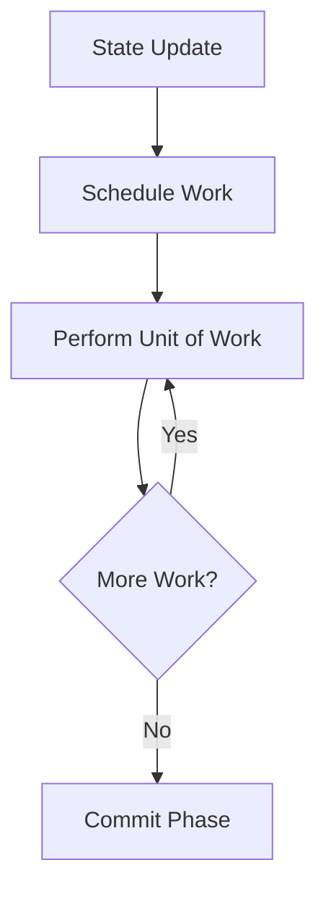

# Under the Hood of the React Reconciler: A High-Level Deep Dive

Have you ever wondered how React actually updates the DOM? We call it "magic," but it's actually a sophisticated piece of engineering known as the **Reconciler**. In this post, we'll peel back the layers and understand how React 18 handles updates using Fiber architecture.

## The Problem: Blocking the Main Thread

In the early days of React (pre-v16), the reconciliation process was recursive. Once it started, it couldn't be interrupted. If you had a large component tree, the main thread would be blocked, causing dropped frames and a "janky" user experience.

## The Solution: Fiber Architecture

Introduced in React 16, **Fiber** changed everything. Instead of a recursive tree traversal, Fiber is a virtual stack frame that represents a unit of work. This allows React to:
1. **Pause work** and come back to it later.
2. **Assign priority** to different types of updates (e.g., user input has higher priority than a background data fetch).
3. **Reuse previous work** or abort it if no longer needed.

## The Reconciliation Lifecycle

The process happens in two main phases:

### Phase 1: Render (Asynchronous)
React traverses the component tree and builds a "work-in-progress" tree. It calculates the differences (diffing) between the current tree and the new one. 



Crucially, this phase can be interrupted by the browser if it needs to handle a high-priority event (like a click or animation frame).

### Phase 2: Commit (Synchronous)
Once the work is finished, React enters the commit phase. This is where it actually applies the changes to the DOM. This phase is synchronous to ensure that the UI remains consistent.

## Fiber Nodes: The Unit of Work

Each React element has a corresponding Fiber node. A Fiber node contains:
- `type`: The component type (e.g., 'div', 'UserProfile').
- `key`: The unique identifier.
- `stateNode`: The actual DOM element or class instance.
- `child`, `sibling`, `return`: Pointers to other Fiber nodes, forming a linked list rather than a simple tree.

## Visualizing the Linked List

Instead of `children: []`, Fibers use a linked list structure:

```
App (Fiber)
 └── child: Header (Fiber)
      └── sibling: Main (Fiber)
           └── child: Post (Fiber)
```

This structure is what allows React to "walk" the tree without recursion, making it easy to pause and resume.

## Practical Implications for Developers

Understanding Fiber helps you write better React code:
- **Avoid heavy work in render**: Since the render phase can run multiple times, keep your component bodies pure.
- **Use `useTransition` and `useDeferredValue`**: These APIs allow you to explicitly take advantage of Fiber's priority scheduling.

## Conclusion

The React Reconciler is a masterpiece of computer science applied to the UI. By treating the UI as a series of interruptible tasks, React provides the "smooth" feeling we expect from modern web applications.

---

**Want to dive deeper?** Check out the [React Source Code](https://github.com/facebook/react/tree/main/packages/react-reconciler) on GitHub.
