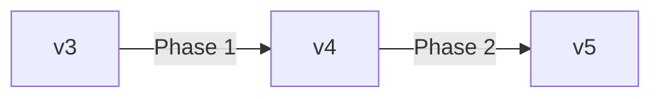
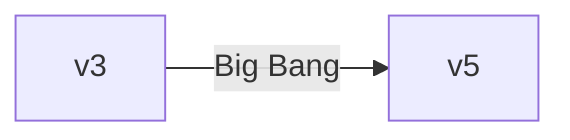

# React Query v3 → TanStack Query v5 Migration

Comprehensive migration guide for upgrading from React Query v3 to TanStack Query v5, covering the complete upgrade path, breaking changes, automated codemods, and production-ready migration strategies.

## Overview

TanStack Query v5 (formerly React Query) represents a major evolution with improved TypeScript support, dedicated Suspense hooks, simplified APIs, and better performance. This guide covers the complete upgrade path: **v3 → v4 → v5** or **direct v3 → v5**.

**Key Benefits of v5:**
- **Better TypeScript**: Improved type inference, no more 4-generic hell
- **Suspense Integration**: Dedicated `useSuspenseQuery` hooks with guaranteed non-undefined data
- **Simplified API**: Single object syntax for all hooks
- **Performance**: Faster cache updates, better memory management
- **Bundle Size**: Smaller footprint (~13KB → ~11KB gzipped)

## When to Use This Skill

- Migrating React Query v3 applications to v5
- Upgrading from v4 to v5 (smaller breaking changes)
- Adopting Suspense patterns for data fetching
- Improving TypeScript type safety in queries
- Modernizing data fetching architecture
- Reducing technical debt in legacy React Query codebases

## Do Not Use This Skill When

- You don't use React Query (use other migration skills)
- Your app is already on TanStack Query v5
- You need migration from other libraries (use `zustand-migration`, `redux-migration`, etc.)

---

## Migration Path Options

### Option 1: Incremental v3 → v4 → v5 (Recommended for Large Apps)

**Best for:** Large codebases, production apps, teams wanting to minimize risk



**Pros:**
- Smaller changesets per phase
- Easier to test and validate
- Gradual team learning curve
- Lower risk of breaking production

**Cons:**
- Longer migration timeline
- More PRs and reviews

### Option 2: Direct v3 → v5 (Fast Track)

**Best for:** Small apps, greenfield projects, high-confidence teams



**Pros:**
- Single migration effort
- Faster completion
- Latest features immediately

**Cons:**
- Larger changeset
- Higher risk
- More testing required

---

## Breaking Changes Overview

### v3 → v4 Major Changes

| v3 API | v4 API | Type | Description |
|--------|--------|------|-------------|
| `cacheTime` | `gcTime` | Renamed | Garbage collection time |
| `useQuery(key, fn, opts)` | `useQuery({ queryKey, queryFn, ...opts })` | Signature | Object syntax required |
| `onSuccess` callback | Removed | Deprecated | Use `queryClient.invalidateQueries()` in mutations |
| `onError` callback | Removed | Deprecated | Use Error Boundaries or `throwOnError` |
| `onSettled` callback | Removed | Deprecated | Use Promise chaining in `mutationFn` |
| `remove` method | `clear` | Renamed | Clear query cache |
| `isFetching` | Multiple flags | Refined | Now `isPending`, `isLoading`, `isFetching` |

### v4 → v5 Major Changes

| v4 API | v5 API | Type | Description |
|--------|--------|------|-------------|
| `suspense: true` | `useSuspenseQuery` | New Hook | Dedicated Suspense hooks |
| `useQuery\u003cTData, TError, ...>` | Inference from `queryFn` | TypeScript | Simplified generics |
| `isLoading` | `isPending` | Renamed | Better semantic naming |
| `status === 'loading'` | `status === 'pending'` | Renamed | Consistent with `isPending` |
| `isInitialLoading` | `isLoading` | Renamed | `isLoading = isPending && isFetching` |
| `keepPreviousData` | `placeholderData` | Changed | More flexible previous data handling |
| `QueryFunctionContext\u003cTKey, TPage>` | `QueryFunctionContext\u003cTKey>` | TypeScript | Simplified context type |

---

## Step-by-Step Migration Guide

### Phase 1: Preparation (v3 → v4)

#### 1.1 Update Dependencies

```bash
# Remove v3
npm uninstall react-query

# Install v4
npm install @tanstack/react-query@4 @tanstack/react-query-devtools@4
```

#### 1.2 Update Imports

```tsx
// v3
import { useQuery, useMutation, QueryClient } from 'react-query'
import { ReactQueryDevtools } from 'react-query/devtools'

// v4
import { useQuery, useMutation, QueryClient } from '@tanstack/react-query'
import { ReactQueryDevtools } from '@tanstack/react-query-devtools'
```

**Find & Replace Pattern:**
```bash
# Unix/Mac
find src -type f -name "*.tsx" -o -name "*.ts" | xargs sed -i '' "s/'react-query'/'@tanstack\/react-query'/g"

# Or use your IDE's global find & replace
```

#### 1.3 Run Codemod for Object Syntax

TanStack provides official codemods to automate the migration:

```bash
# For TypeScript/TSX
npx jscodeshift@latest ./src \
  --extensions=ts,tsx \
  --parser=tsx \
  --transform=./node_modules/@tanstack/react-query/build/codemods/src/v5/remove-overloads/remove-overloads.cjs

# For JavaScript/JSX
npx jscodeshift@latest ./src \
  --extensions=js,jsx \
  --transform=./node_modules/@tanstack/react-query/build/codemods/src/v5/remove-overloads/remove-overloads.cjs
```

**What the codemod does:**
- Converts `useQuery(key, fn, opts)` → `useQuery({ queryKey, queryFn, ...opts })`
- Converts `useMutation(fn, opts)` → `useMutation({ mutationFn, ...opts })`
- Converts `useInfiniteQuery` signatures
- Converts `useIsFetching` and `useIsMutating` signatures

#### 1.4 Rename Properties (Find & Replace)

| Find | Replace | Files |
|------|---------|-------|
| `cacheTime:` | `gcTime:` | `*.ts`, `*.tsx` |
| `useErrorBoundary` | `throwOnError` | `*.ts`, `*.tsx` |

**Regex Find & Replace:**
```regex
// Find
\bcacheTime:\s*

// Replace
gcTime: 
```

#### 1.5 Remove Deprecated Callbacks

**Before (v3):**
```tsx
const mutation = useMutation(createUser, {
  onSuccess: (data) => {
    queryClient.invalidateQueries(['users'])
    showToast('Success!')
  },
  onError: (error) => {
    showToast(`Error: ${error.message}`)
  },
  onSettled: () => {
    setIsSubmitting(false)
  }
})
```

**After (v4):**
```tsx
const mutation = useMutation({
  mutationFn: createUser,
})

// Move side effects to the mutation call site
const handleSubmit = async (userData) => {
  try {
    const data = await mutation.mutateAsync(userData)
    queryClient.invalidateQueries({ queryKey: ['users'] })
    showToast('Success!')
  } catch (error) {
    showToast(`Error: ${error.message}`)
  } finally {
    setIsSubmitting(false)
  }
}
```

**Why this change?**
- Callbacks made it hard to track side effects
- Encouraged anti-patterns (e.g., updating state in callbacks)
- Promise-based API is more composable

#### 1.6 Test v4 Migration

```bash
# Run tests
npm test

# Check TypeScript
npm run type-check

# Manual testing checklist
- [ ] All queries render correctly
- [ ] Mutations work and invalidate caches
- [ ] Loading states display properly
- [ ] Error states handled correctly
- [ ] DevTools functional
```

---

### Phase 2: v4 → v5 Migration

#### 2.1 Update to v5

```bash
npm install @tanstack/react-query@5 @tanstack/react-query-devtools@5
```

#### 2.2 Update QueryClient Configuration

```tsx
// v4
const queryClient = new QueryClient({
  defaultOptions: {
    queries: {
      cacheTime: 1000 * 60 * 10,
    },
  },
})

// v5
const queryClient = new QueryClient({
  defaultOptions: {
    queries: {
      gcTime: 1000 * 60 * 10, // Already renamed in v4
    },
  },
})
```

#### 2.3 Migrate to Suspense Hooks

**Before (v4 with Suspense flag):**
```tsx
function UserProfile({ userId }) {
  const { data } = useQuery({
    queryKey: ['user', userId],
    queryFn: () => fetchUser(userId),
    suspense: true, // ❌ Deprecated in v5
  })

  // TypeScript: data is User | undefined
  return <div>{data?.name}</div>
}
```

**After (v5 with dedicated hook):**
```tsx
import { useSuspenseQuery } from '@tanstack/react-query'

function UserProfile({ userId }) {
  const { data } = useSuspenseQuery({
    queryKey: ['user', userId],
    queryFn: () => fetchUser(userId),
  })

  // TypeScript: data is User (never undefined!)
  return <div>{data.name}</div>
}

// Wrap with Suspense boundary in parent
function App() {
  return (
    <Suspense fallback={<Loading />}>
      <UserProfile userId={1} />
    </Suspense>
  )
}
```

**New Suspense Hooks:**
- `useSuspenseQuery` - Single query with Suspense
- `useSuspenseInfiniteQuery` - Infinite scroll with Suspense
- `useSuspenseQueries` - Parallel queries with Suspense

**TypeScript Benefits:**
```tsx
const { data } = useSuspenseQuery({ ... })
//     ^? data: User (not User | undefined)

// No more null checks!
console.log(data.name) // ✅ TypeScript knows data exists
```

#### 2.4 Update Status Checks

| v4 Pattern | v5 Pattern | Reason |
|------------|------------|--------|
| `isLoading` | `isPending` | `isLoading` now means `isPending && isFetching` |
| `status === 'loading'` | `status === 'pending'` | Consistent naming |
| `isInitialLoading` | `isLoading` | Swapped semantic meaning |

**Migration Pattern:**
```tsx
// v4
if (isLoading) return <Spinner />

// v5 - Option 1: Use isPending (recommended)
if (isPending) return <Spinner />

// v5 - Option 2: Keep isLoading if you want "initial fetch only"
if (isLoading) return <Spinner /> // isLoading = isPending && isFetching
```

**Decision Matrix:**

| Scenario | v5 API | Explanation |
|----------|--------|-------------|
| Show spinner during ANY fetch | `isPending` | Includes initial + background fetches |
| Show spinner ONLY on initial load | `isLoading` | First fetch only |
| Show inline "updating..." | `isFetching && !isPending` | Background refetch |

#### 2.5 Update Infinite Queries

**v4:**
```tsx
const { data, fetchNextPage } = useInfiniteQuery({
  queryKey: ['projects'],
  queryFn: ({ pageParam = 0 }) => fetchProjects(pageParam),
  getNextPageParam: (lastPage) => lastPage.nextCursor,
})
```

**v5 (initialPageParam now required):**
```tsx
const { data, fetchNextPage } = useInfiniteQuery({
  queryKey: ['projects'],
  queryFn: ({ pageParam }) => fetchProjects(pageParam),
  initialPageParam: 0, // ✅ Now required in v5
  getNextPageParam: (lastPage) => lastPage.nextCursor,
})
```

**TypeScript will enforce this:**
```tsx
// ❌ TypeScript error in v5
useInfiniteQuery({ queryKey, queryFn, getNextPageParam })
// Property 'initialPageParam' is missing
```

#### 2.6 Simplify TypeScript Generics

**v4 (verbose):**
```tsx
const query = useQuery<
  User,           // TQueryFnData
  Error,          // TError
  User,           // TData
  ['user', number] // TQueryKey
>({
  queryKey: ['user', userId],
  queryFn: () => fetchUser(userId),
})
```

**v5 (inference):**
```tsx
// Let TypeScript infer from queryFn
const query = useQuery({
  queryKey: ['user', userId],
  queryFn: () => fetchUser(userId), // Returns Promise<User>
})
// query.data is User | undefined
// query.error is Error | null
```

**When to provide generics:**
- Custom `select` function with different output type
- Error type is not `Error`
- Query function returns `unknown` or `any`

```tsx
// Example: select transforms data type
const query = useQuery({
  queryKey: ['user', userId],
  queryFn: () => fetchUser(userId), // Returns User
  select: (user) => user.name, // Transform to string
})
// query.data is string | undefined (inferred!)
```

#### 2.7 Update keepPreviousData Pattern

**v4:**
```tsx
const { data } = useQuery({
  queryKey: ['posts', page],
  queryFn: () => fetchPosts(page),
  keepPreviousData: true, // ❌ Removed in v5
})
```

**v5 (use placeholderData):**
```tsx
const { data } = useQuery({
  queryKey: ['posts', page],
  queryFn: () => fetchPosts(page),
  placeholderData: (previousData) => previousData, // ✅ More flexible
})
```

**Advanced placeholder patterns:**
```tsx
// Option 1: Keep previous data
placeholderData: (previousData) => previousData

// Option 2: Custom placeholder
placeholderData: { items: [], total: 0 }

// Option 3: Conditional placeholder
placeholderData: (previousData, previousQuery) => {
  return previousQuery?.queryKey[1] === page - 1 
    ? previousData 
    : undefined
}
```

---

## Common Migration Patterns

### Pattern 1: Query with Dependent Data

**v3:**
```tsx
const { data: user } = useQuery(['user', userId], () => fetchUser(userId))
const { data: posts } = useQuery(
  ['posts', user?.id],
  () => fetchUserPosts(user.id),
  { enabled: !!user }
)
```

**v5:**
```tsx
const { data: user } = useQuery({
  queryKey: ['user', userId],
  queryFn: () => fetchUser(userId),
})

const { data: posts } = useQuery({
  queryKey: ['posts', user?.id],
  queryFn: () => fetchUserPosts(user!.id),
  enabled: !!user, // Still works the same
})
```

### Pattern 2: Optimistic Updates

**v3:**
```tsx
const mutation = useMutation(updateTodo, {
  onMutate: async (newTodo) => {
    await queryClient.cancelQueries(['todos'])
    const previous = queryClient.getQueryData(['todos'])
    queryClient.setQueryData(['todos'], (old) => [...old, newTodo])
    return { previous }
  },
  onError: (err, newTodo, context) => {
    queryClient.setQueryData(['todos'], context.previous)
  },
})
```

**v5:**
```tsx
const mutation = useMutation({
  mutationFn: updateTodo,
  onMutate: async (newTodo) => {
    await queryClient.cancelQueries({ queryKey: ['todos'] })
    const previous = queryClient.getQueryData(['todos'])
    queryClient.setQueryData(['todos'], (old) => [...old, newTodo])
    return { previous }
  },
  onError: (err, newTodo, context) => {
    queryClient.setQueryData(['todos'], context.previous)
  },
})
```

**Changes:**
- `cancelQueries` now requires object syntax
- Rest of the pattern remains the same

### Pattern 3: Parallel Queries

**v3:**
```tsx
const user = useQuery(['user', userId], () => fetchUser(userId))
const posts = useQuery(['posts', userId], () => fetchPosts(userId))
const comments = useQuery(['comments', userId], () => fetchComments(userId))
```

**v5 with useQueries:**
```tsx
const results = useQueries({
  queries: [
    {
      queryKey: ['user', userId],
      queryFn: () => fetchUser(userId),
    },
    {
      queryKey: ['posts', userId],
      queryFn: () => fetchPosts(userId),
    },
    {
      queryKey: ['comments', userId],
      queryFn: () => fetchComments(userId),
    },
  ],
})

const [user, posts, comments] = results
```

### Pattern 4: Infinite Scroll

**v3:**
```tsx
const {
  data,
  fetchNextPage,
  hasNextPage,
} = useInfiniteQuery(
  ['posts'],
  ({ pageParam = 0 }) => fetchPosts(pageParam),
  {
    getNextPageParam: (lastPage) => lastPage.nextCursor,
  }
)
```

**v5:**
```tsx
const {
  data,
  fetchNextPage,
  hasNextPage,
} = useInfiniteQuery({
  queryKey: ['posts'],
  queryFn: ({ pageParam }) => fetchPosts(pageParam),
  initialPageParam: 0, // ✅ Required
  getNextPageParam: (lastPage) => lastPage.nextCursor,
})
```

---

## TypeScript Migration Guide

### Type Safety Improvements

**v3/v4 - Manual type assertions:**
```tsx
const { data } = useQuery<User>(['user', id], fetchUser)

if (data) {
  console.log(data.name) // data is User | undefined
}
```

**v5 - Type inference:**
```tsx
// Define typed query function
const fetchUser = async (id: number): Promise<User> => {
  const response = await fetch(`/api/users/${id}`)
  return response.json()
}

const { data } = useQuery({
  queryKey: ['user', id],
  queryFn: () => fetchUser(id), // Type automatically inferred!
})

if (data) {
  console.log(data.name) // TypeScript knows data is User
}
```

### Suspense Type Safety

**v4 - No type guarantee:**
```tsx
const { data } = useQuery({
  queryKey: ['user', id],
  queryFn: fetchUser,
  suspense: true,
})

console.log(data.name) // ❌ TS error: data might be undefined
console.log(data!.name) // 🤔 Need non-null assertion
```

**v5 - Guaranteed types:**
```tsx
const { data } = useSuspenseQuery({
  queryKey: ['user', id],
  queryFn: fetchUser,
})

console.log(data.name) // ✅ No error, data is always User
```

### Query Function Context Types

**v4:**
```tsx
import type { QueryFunctionContext } from '@tanstack/react-query'

const fetchUser = async (
  context: QueryFunctionContext<['user', number], number>
) => {
  const [, userId] = context.queryKey
  const pageParam = context.pageParam
  // ...
}
```

**v5 - Simplified:**
```tsx
import type { QueryFunctionContext } from '@tanstack/react-query'

const fetchUser = async (
  context: QueryFunctionContext<['user', number]>
) => {
  const [, userId] = context.queryKey
  // pageParam is now part of queryKey type automatically
  // ...
}
```

---

## Troubleshooting Common Issues

### Issue 1: "Property 'suspense' does not exist"

**Error:**
```tsx
const { data } = useQuery({
  suspense: true, // ❌ Error in v5
  queryKey: ['user'],
  queryFn: fetchUser,
})
```

**Solution:**
```tsx
import { useSuspenseQuery } from '@tanstack/react-query'

const { data } = useSuspenseQuery({
  queryKey: ['user'],
  queryFn: fetchUser,
})
```

### Issue 2: "data is possibly undefined"

**Error:**
```tsx
const { data } = useQuery({ ... })
console.log(data.name) // ❌ TS error: data possibly undefined
```

**Solutions:**

```tsx
// Option 1: Type guard
if (data) {
  console.log(data.name) // ✅
}

// Option 2: Optional chaining
console.log(data?.name) // ✅

// Option 3: Use Suspense (best)
const { data } = useSuspenseQuery({ ... })
console.log(data.name) // ✅ data always defined
```

### Issue 3: "initialPageParam is required"

**Error:**
```tsx
useInfiniteQuery({
  queryKey: ['items'],
  queryFn: ({ pageParam = 0 }) => fetch(pageParam), // ❌ Error
  getNextPageParam: (lastPage) => lastPage.next,
})
```

**Solution:**
```tsx
useInfiniteQuery({
  queryKey: ['items'],
  queryFn: ({ pageParam }) => fetch(pageParam),
  initialPageParam: 0, // ✅ Add this
  getNextPageParam: (lastPage) => lastPage.next,
})
```

### Issue 4: "cacheTime is not a valid option"

**Error:**
```tsx
useQuery({
  cacheTime: 1000 * 60, // ❌ Not recognized in v4+
  queryKey: ['data'],
  queryFn: fetchData,
})
```

**Solution:**
```tsx
useQuery({
  gcTime: 1000 * 60, // ✅ Renamed to gcTime
  queryKey: ['data'],
  queryFn: fetchData,
})
```

### Issue 5: Callbacks not firing

**Error:**
```tsx
useMutation({
  mutationFn: createUser,
  onSuccess: () => console.log('Success'), // ❌ Not called in v4+
})
```

**Solution:**
```tsx
const mutation = useMutation({
  mutationFn: createUser,
})

// Use promise-based approach
mutation.mutate(userData, {
  onSuccess: () => console.log('Success'), // ✅ Works
})

// Or async/await
try {
  await mutation.mutateAsync(userData)
  console.log('Success') // ✅ Works
} catch (error) {
  console.error(error)
}
```

---

## Testing Strategy

### Unit Tests

```tsx
import { renderHook, waitFor } from '@testing-library/react'
import { QueryClient, QueryClientProvider } from '@tanstack/react-query'
import { useQuery } from '@tanstack/react-query'

const createWrapper = () => {
  const queryClient = new QueryClient({
    defaultOptions: {
      queries: { retry: false },
    },
  })
  return ({ children }) => (
    <QueryClientProvider client={queryClient}>
      {children}
    </QueryClientProvider>
  )
}

test('fetches data successfully', async () => {
  const { result } = renderHook(
    () => useQuery({
      queryKey: ['test'],
      queryFn: () => Promise.resolve({ name: 'Test' }),
    }),
    { wrapper: createWrapper() }
  )

  await waitFor(() => expect(result.current.isSuccess).toBe(true))
  expect(result.current.data).toEqual({ name: 'Test' })
})
```

### Integration Tests

```tsx
import { screen, render, waitFor } from '@testing-library/react'
import { QueryClient, QueryClientProvider } from '@tanstack/react-query'
import { UserProfile } from './UserProfile'

test('displays user profile', async () => {
  const queryClient = new QueryClient()
  
  render(
    <QueryClientProvider client={queryClient}>
      <UserProfile userId={1} />
    </QueryClientProvider>
  )

  await waitFor(() => {
    expect(screen.getByText(/John Doe/i)).toBeInTheDocument()
  })
})
```

---

## Migration Checklist

### Pre-Migration

- [ ] Review current React Query usage (run audit)
- [ ] Update Node.js to v14+ (required for v5)
- [ ] Update React to v18+ (recommended for Suspense)
- [ ] Document custom query patterns
- [ ] Establish rollback plan

### v3 → v4 Migration

- [ ] Update package to `@tanstack/react-query@4`
- [ ] Update all imports from `react-query` to `@tanstack/react-query`
- [ ] Run codemod for object syntax conversion
- [ ] Rename `cacheTime` → `gcTime`
- [ ] Remove `onSuccess`, `onError`, `onSettled` callbacks
- [ ] Update tests
- [ ] Deploy to staging and validate
- [ ] Deploy to production

### v4 → v5 Migration

- [ ] Update package to `@tanstack/react-query@5`
- [ ] Rename `isLoading` → `isPending` (where appropriate)
- [ ] Update `status === 'loading'` → `status === 'pending'`
- [ ] Add `initialPageParam` to all `useInfiniteQuery` calls
- [ ] Migrate `suspense: true` → `useSuspenseQuery`
- [ ] Replace `keepPreviousData` with `placeholderData`
- [ ] Simplify TypeScript generics (let inference work)
- [ ] Update `QueryFunctionContext` types
- [ ] Test Suspense boundaries
- [ ] Verify all error handling works
- [ ] Deploy to staging
- [ ] Monitor performance metrics
- [ ] Deploy to production

### Post-Migration

- [ ] Remove old v3 dependencies
- [ ] Update documentation
- [ ] Train team on v5 patterns
- [ ] Monitor error rates
- [ ] Collect performance metrics
- [ ] Document lessons learned

---

## Performance Optimization

### Bundle Size Comparison

| Version | Minified | Gzipped | Savings |
|---------|----------|---------|---------|
| v3 | 41.5 KB | 13.2 KB | - |
| v4 | 40.1 KB | 12.8 KB | -3% |
| v5 | 36.7 KB | 11.4 KB | -14% from v3 |

### Cache Optimization

```tsx
const queryClient = new QueryClient({
  defaultOptions: {
    queries: {
      // Aggressive caching for static data
      staleTime: 1000 * 60 * 5, // 5 minutes
      gcTime: 1000 * 60 * 30,   // 30 minutes
      
      // Network optimization
      refetchOnWindowFocus: false,
      refetchOnReconnect: true,
      retry: 3,
      retryDelay: (attemptIndex) => Math.min(1000 * 2 ** attemptIndex, 30000),
    },
  },
})
```

### Prefetching Strategy

```tsx
// Prefetch on hover (better UX)
const prefetchUser = (userId: number) => {
  queryClient.prefetchQuery({
    queryKey: ['user', userId],
    queryFn: () => fetchUser(userId),
    staleTime: 1000 * 60, // Cache for 1 minute
  })
}

<Link 
  to={`/users/${user.id}`}
  onMouseEnter={() => prefetchUser(user.id)}
>
  {user.name}
</Link>
```

---

## Best Practices

### ✅ Do This

1. **Use Query Keys Consistently**
   ```tsx
   // ✅ Good - hierarchical keys
   ['users']
   ['users', userId]
   ['users', userId, 'posts']
   ```

2. **Leverage Suspense for Better UX**
   ```tsx
   <Suspense fallback={<Skeleton />}>
     <UserProfile /> {/* useSuspenseQuery inside */}
   </Suspense>
   ```

3. **Invalidate Queries After Mutations**
   ```tsx
   await mutation.mutateAsync(data)
   queryClient.invalidateQueries({ queryKey: ['users'] })
   ```

4. **Use TypeScript Inference**
   ```tsx
   // Let queryFn provide types
   const { data } = useQuery({
     queryKey: ['user'],
     queryFn: (): Promise<User> => fetchUser(),
   })
   ```

### ❌ Don't Do This

1. **Don't Use Old Callback Patterns**
   ```tsx
   // ❌ Bad
   useMutation(fn, {
     onSuccess: () => { /* ... */ },
   })
   
   // ✅ Good
   mutation.mutate(data, {
     onSuccess: () => { /* ... */ },
   })
   ```

2. **Don't Over-Specify Generics**
   ```tsx
   // ❌ Verbose
   useQuery<User, Error, User, ['user', number]>({ ... })
   
   // ✅ Let inference work
   useQuery({ queryKey: ['user', id], queryFn: fetchUser })
   ```

3. **Don't Forget initialPageParam**
   ```tsx
   // ❌ Will error in v5
   useInfiniteQuery({ queryFn, getNextPageParam })
   
   // ✅ Required
   useInfiniteQuery({ queryFn, initialPageParam: 0, getNextPageParam })
   ```

---

## Resources

### Official Documentation
- [TanStack Query v5 Docs](https://tanstack.com/query/v5)
- [Migration Guide v3→v4](https://tanstack.com/query/v4/docs/react/guides/migrating-to-react-query-4)
- [Migration Guide v4→v5](https://tanstack.com/query/v5/docs/react/guides/migrating-to-v5)
- [Codemods](https://tanstack.com/query/v5/docs/react/guides/migrating-to-v5#run-the-codemod)

### Community Resources
- [TanStack Discord](https://tanner.cn/discord)
- [GitHub Discussions](https://github.com/TanStack/query/discussions)
- [Stack Overflow Tag](https://stackoverflow.com/questions/tagged/react-query)

### Related Skills
- `@tanstack-query-v5` - Using TanStack Query v5
- `@react-patterns` - Modern React patterns
- `@typescript-expert` - TypeScript best practices
- `@react-modernization` - React upgrade patterns

---

## Quick Reference

### Common Commands

```bash
# Install v5
npm install @tanstack/react-query@5

# Run codemod
npx jscodeshift ./src --extensions=ts,tsx --parser=tsx \
  --transform=./node_modules/@tanstack/react-query/build/codemods/src/v5/remove-overloads/remove-overloads.cjs

# Type check
npm run type-check
```

### Key API Changes

| v3/v4 | v5 | Category |
|-------|-----|----------|
| `cacheTime` | `gcTime` | Config |
| `isLoading` | `isPending` | State |
| `isInitialLoading` | `isLoading` | State |
| `suspense: true` | `useSuspenseQuery` | Hook |
| `keepPreviousData` | `placeholderData` | Option |
| `useQuery(key, fn, opts)` | `useQuery({ queryKey, queryFn, ...opts })` | Signature |

---

**Remember:** The migration is incremental. Test thoroughly at each step, and don't hesitate to stay on v4 if v5 doesn't provide immediate value for your use case.
